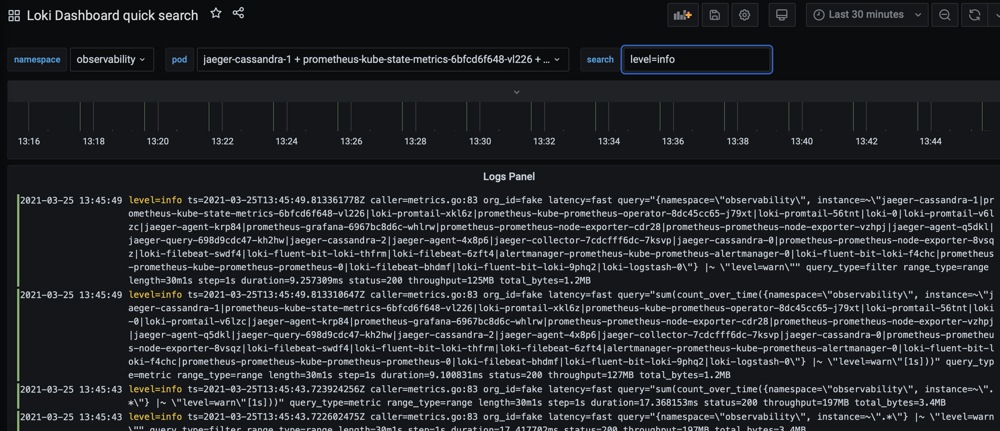

## terraform-aws-infrastructure

[](https://github.com/cloud-native-skunkworks/terraform-aws-infrastructure/actions/workflows/terraform.yml)

This project contains resources for SRE infrastructure to be deployed to AWS.

Requirements:
- kubectl
- helm
- tfenv
- awscli


Using the loki datasource within Grafana...




## Installation

- terraform login ( you can modify the backend to your workspace in terraform cloud )
```
cd terraform
terraform apply -target=module.cluster
terraform apply -target=module.deployment
```

### Cluster access

```
aws eks --region eu-west-2 update-kubeconfig --name sre-infra
```
or use...
```
TOKEN=$(terraform output -raw cluster_token)
```
